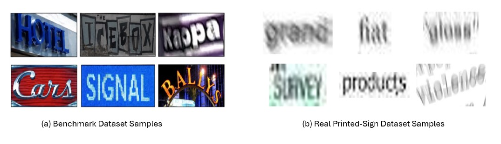

# DAM-PARSeq

**Deformable Attention Module Enhanced PARSeq for Robust Scene Text Recognition**

## Getting Started

This repository provides the implementation of **DAM-PARSeq**, a modified version of the original PARSeq framework for robust Scene Text Recognition (STR).

The original PARSeq framework combines a Vision Transformer (ViT) encoder with a Permutation Language Modeling (PLM)-based decoder for sequence recognition. However, visual degradation factors, including blur, occlusion, distortion, illumination variation, and background interference, can reduce the quality of extracted visual representations.

To address these limitations, DAM-PARSeq introduces a **Deformable Attention Module (DAM)** between the ViT encoder and the PARSeq decoder. DAM adaptively refines visual tokens before sequence prediction while preserving the original PARSeq decoding strategy.

This repository is developed based on the original PARSeq implementation:

https://github.com/baudm/parseq


## Demo

An inference demo can be performed using the provided testing pipeline after preparing the required dependencies and model checkpoint.


## Installation

### Requirements

- Python >= 3.9
- PyTorch >= 2.0

Create environment:

```bash
conda create -n DAM_Parseq python=3.9
conda activate DAM_Parseq
```

Install dependencies:

```bash
pip install -r requirements.txt
```


## Dataset Preparation

DAM-PARSeq follows the original PARSeq evaluation protocol.

## Dataset Samples



### Training Datasets

Synthetic training datasets:

- MJSynth (MJ)
- SynthText (ST)

The synthetic training datasets (MJ and ST) and benchmark evaluation datasets follow the original PARSeq dataset preparation protocol.

### Benchmark Evaluation Datasets

Standard scene text recognition benchmarks:

- IIIT5K
- SVT
- IC13
- IC15
- SVTP
- CUTE80

Dataset preparation follows the original PARSeq repository.
Dataset source:

https://drive.google.com/drive/folders/1NYuoi7dfJVgo-zUJogh8UQZgIMpLviOE

# Method Overview

## Baseline-PARSeq

The original PARSeq framework follows:

```text
Input Image
      |
      v
ViT Encoder
      |
      v
Visual Tokens
      |
      v
PARSeq Decoder
      |
      v
Output Sequence
```

The visual features extracted from the ViT encoder are directly transferred to the PARSeq decoder.


## Proposed DAM-PARSeq

The proposed framework inserts DAM between the ViT encoder and PARSeq decoder:

```text
Input Image
      |
      v
ViT Encoder
      |
      v
Visual Tokens
      |
      v
Deformable Attention Module (DAM)
      |
      v
Enhanced Visual Features
      |
      v
PARSeq Decoder
      |
      v
Output Sequence
```

DAM learns adaptive sampling locations and attention weights to enhance informative visual regions while reducing degraded visual responses.

The original PARSeq decoder and permutation language modeling strategy remain unchanged.


# Repository Structure

```text
DAM-PARSeq/

├── configs/
│
├── datasets/
│
├── models/
│   └── parseq/
│       ├── Baseline-PARSeq/
│       └── DAM-PARSeq/
│
├── train.py
├── test.py
├── requirements.txt
└── README.md
```


# Model Modification

The original PARSeq framework:

```python
visual_features = encoder(image)

prediction = decoder(visual_features)
```


DAM-PARSeq:

```python
visual_features = encoder(image)

refined_features = DAM(visual_features)

prediction = decoder(refined_features)
```

DAM improves visual representation quality before decoding without modifying the PARSeq decoder architecture.


# Training Procedure

The training procedure follows the original PARSeq framework.

Training steps:

1. Input images are processed by the ViT encoder.
2. Visual tokens are extracted.
3. DAM refines visual representations.
4. Enhanced visual features are passed to the PARSeq decoder.
5. Recognition loss is optimized.

## Training

DAM-PARSeq follows the original PARSeq training pipeline with the additional DAM refinement module.

### Basic Training Command

```bash
python train.py dataset=real
```

Other dataset options can be specified through:

```text
configs/dataset/
```

---

### Character Set Configuration

Specify the character set for training:

```bash
python train.py charset=94_full
```

Available options:

- `36_lowercase`
- `62_mixed-case`
- `94_full`

Configuration files:

```text
configs/charset/
```

---

### Model Training Parameters

Modify general model parameters:

```bash
python train.py \
model.img_size=[32,128] \
model.max_label_length=25 \
model.batch_size=384
```

---

### Trainer Parameters

Modify PyTorch Lightning trainer settings:

```bash
python train.py \
trainer.max_epochs=20 \
trainer.accelerator=gpu \
trainer.devices=2
```

For a single GPU:

```bash
python train.py \
trainer.accelerator=gpu \
trainer.devices=1
```

---

### Data Parameters

Modify data-related settings:

```bash
python train.py \
data.root_dir=data \
data.num_workers=2 \
data.augment=true
```

---

### Configuration Override

Any configuration parameter can be modified from the command line.

For parameters not originally defined in `configs/main.yaml`, prefix them with:

```text
+
```

Example:

```bash
python train.py +trainer.devices=1
```

# Evaluation Procedure

Evaluation can be performed using:

```bash
python test.py <checkpoint_path>

./test.py outputs/<model>/<timestamp>/checkpoints/best.ckpt  # or use the released weights: ./test.py pretrained=parseq
*same evaluation procedure for TRVA, ViTSTR, ABINet, CRNN, for an example:python test.py pretrained=crnn
```

Evaluation metrics include:

- Accuracy
- 1-Normalized Edit Distance (1-NED)
- Confidence Score


# Real Printed-Sign Dataset

DAM-PARSeq was additionally evaluated on a real printed-sign dataset containing 804 images.

The dataset contains challenging degradation conditions:

- Motion blur
- Occlusion
- Distortion
- Low illumination
- Background interference
- Partially visible characters

The dataset was collected by the authors for robustness evaluation and is not publicly available due to privacy considerations.


# Reproducing DAM-PARSeq Results

To reproduce the experimental results:

1. Prepare the synthetic STR datasets.
2. Install all required dependencies.
3. Train DAM-PARSeq using the provided training pipeline.
4. Evaluate the trained model using the testing script.
5. Compare performance using Accuracy, 1-NED, and Confidence metrics.


# Citation

This repository is based on the original PARSeq implementation.

If you use this repository, please cite the PARSeq paper:

```bibtex
@InProceedings{bautista2022parseq,
title={Scene Text Recognition with Permuted Autoregressive Sequence Models},
author={Bautista, Darwin and Atienza, Rowel},
booktitle={European Conference on Computer Vision},
pages={178--196},
year={2022},
publisher={Springer Nature Switzerland}
}
```


# Acknowledgement

This work is built upon the original PARSeq implementation. We thank the PARSeq authors for making their code publicly available.
